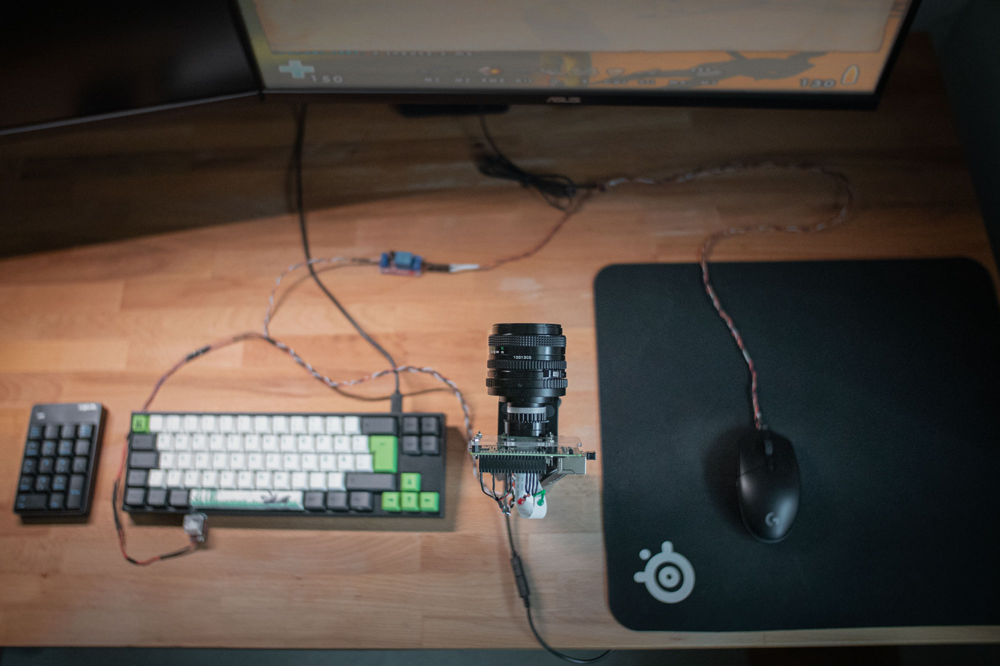
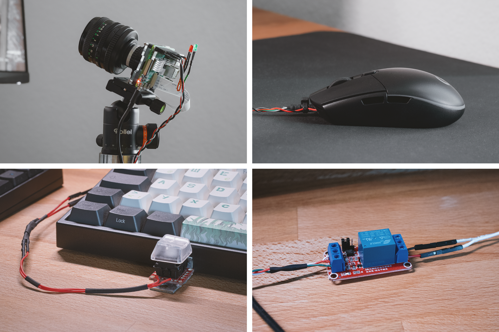
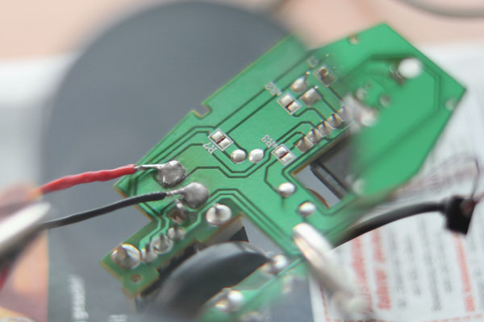
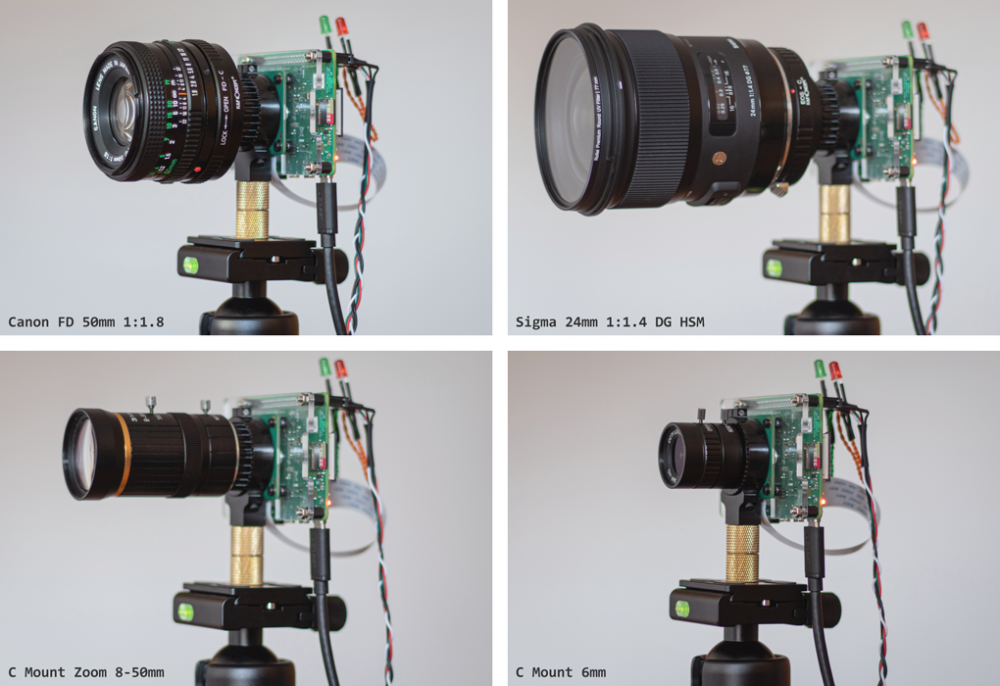
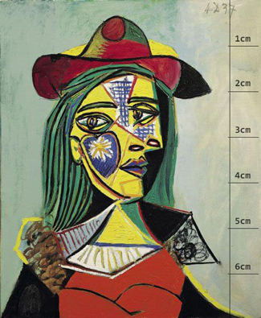
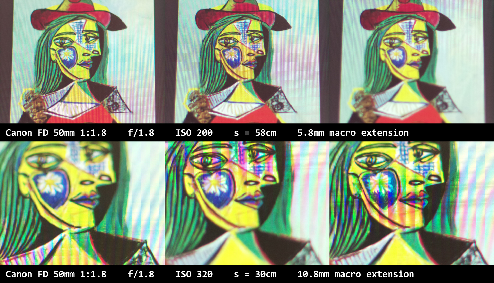
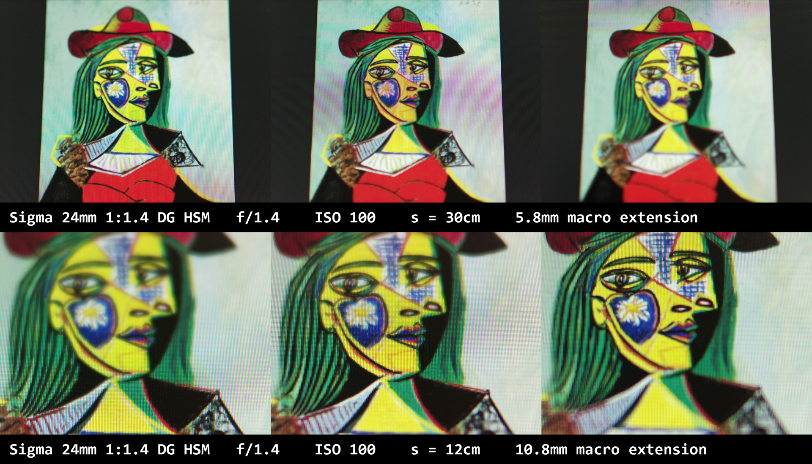
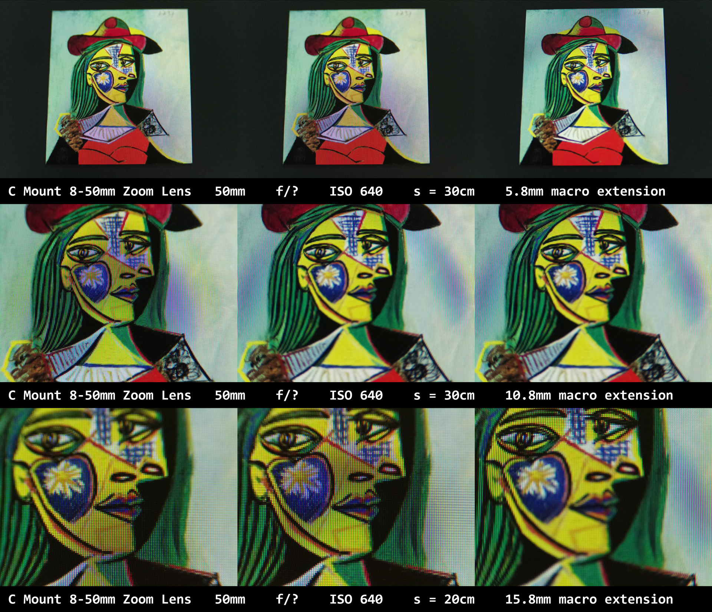

# A Raspberry Pi 4 Based Camera Triggerbot 

## Introduction

The bot reacts to either movement or color around the crosshair. All components operate within a system that is separate from the computer that runs the video game. The camera is directed at the middle of the monitor, small adjustments to focus the exact center can be made using a calibration feature. To control the bot a key is connected to the Pi's GPIO. The relay is connected to the left clicking circuit of the mouse. Opening the relay, which is what happens if the bot finds a target while the key is held down, shorts the mouse circuit and triggers a click. The clicking is - just like using a finger - performed mechanically (inside the relay) and is hence indistinguishable from a real mouse click for the computer that uses the mouse. The intrusion is performed at the analog level, before the mouse digitally processes and passes information to the computer, making this type of input undetectable if used with temporal variation.

Recent non-memory bots that use machine learning to identify targets make use of capture cards to obtain input. I found the delay when using capture cards to be detrimental for a bot that requires speed most of all, so I just made this instead.



__The program uses two different modes:__

### Difference Between Two Consecutive Frames

Consecutive frames are compared and if a config-defined threshold is exceeded the relay is opened. In this example a possible target appears from behind a wall. The white area in the lower frame series is the
difference between $f_n$ and $f_{n-1}$ of the upper series.


### Color Detection

The relay is opened if a config-defined amount of a color is in the focus area. In this example the color purple of a specific brightness and saturation triggers a positive.


## Comparison to Memory Cheats

### Advantages

- Doesn't require reverse engineering
- Doesn't require bypassing an anti-cheat / is undetectable
- Doesn't require updates
- Works for any game (in theory)
- Almost no delay (< 17ms)
- Looks cool

### Disadvantages

- Very limited functionality compared to a memory cheat
- Moving the mouse in 'difference' mode triggers false positives
- Expensive components / hardware based
- Loss of information by recording a monitor
- Requires additional mouse cables
- Requires space on the desk

## Components

Some of these components are optional or exchangeable. Instead of a key, the main computer's keyboard can be used over the network (which exposes the setup to the main computer though). LEDs are optional but useful as status indicators. Depending on the camera-monitor-constellation a different focal length than the suggested 50mm may be suitable.

- Raspberry Pi 4 & peripherals (RP Zero is too slow, RP3 has not been tested so far)
- Raspberry Pi High Quality Camera
- Manual focus lens (e.g. a Canon FD 50mm 1:1.8 with a C-mount adapter and macro extension)
- Tripod (or a different mount like solid steel with a tripod head)
- Relay module (single-channel, 5V)
- Cables, resistors, LEDs and GPIO connectors (crimping, stacking header, ...)
- Key (e.g. a mechanical keyboard switch)
- Mouse (with enough space to run two cables beneath the circuit board)
- A (second) keyboard, most practical is a wireless numpad
- Basic tools to assemble electrical components (soldering iron etc.)





## Lens Considerations

Image quality and viability is determined by the lens. With a sensor size of 3mm x 1.7mm in video mode the full frame equivalent crop factor equals 12.5. Using a 50mm lens for example results in an image that looks like a 625mm lens with a full frame sensor. Further modification can be realized with variation of the back focus distance. To make the bot work properly, the image should cover between 2cm and 6cm in height of the monitor center (smaller monitors with higher pixel density may require a smaller section). A working combination for example is a 50mm lens, 30cm in front of a 27" monitor with approximately 22mm back focus distance as seen in the overview image. The default back focus distance for the RP HQ Camera is 12.8mm. In the following a comparison of different lenses with different back focus distances is showcased. The macro extension is achieved by stacking C-CS adapters between lens and sensor, with the original RP HQ Camera adapter adding 5.8mm and every further adapter 5mm to the distance (the total back focus distance is calculated as the default 12.8mm plus the macro extension). The distance between lens and monitor is labeled as _s_.



To compare colors and detail I used this image. The scale in centimeters is shown as it appeared on my monitor (WQHD, 27") when I took the sample images. For every setup there are three images with the focus being slightly changed (bottom, middle and top).



Differences in the images are a consequence of lens quality (chromatic aberration), focus settings (blurry images have more vibrant colors when filming LCDs), view angle (which is obviously different when changing focal length and camera position), monitor brightness and colors, environment lighting and sensor sensitivity (ISO).

### Canon FD 50mm 1:1.8

This is the recommended type of lens (50mm prime lens with a maximum aperture of 1:1.x), together with two macro extension rings (the lower row images). A modern Canon EF 50mm f/1.8 STM works too but has no manual focus ring. The same applies for other high quality lens manufacturers (Sony, Nikon, Zeiss, etc.).



### Sigma 24mm 1:1.4 DG HSM

Using a 24mm lens still works but the section becomes quite big. The low aperture of 1:1.4 in this example however allows to lower the sensors ISO significantly, resulting in less noise which can be useful if the monitor has poor brightness capabilities.



### C Mount 8-50mm Zoom Lens

This is a cheap no-name lens that is fiddly to use but works. The ISO has to be increased and LCD inflicted distortions are clearly visible. 



### C Mount 6mm Lens

A focal length of 6mm is what is commonly used for webcams. It does not work for the bot, the monitor section is far too big. Focusing it is tough, hence there are only two sample images for this lens.


## Setup

Clone the repository:

```sh
git clone https://github.com/lehmenkuehler/camera-triggerbot
```
Install some prerequisites:

```sh
pip install opencv-python
pip install numpy
pip install keyboard

apt-get install libcblas-dev
apt-get install libhdf5-dev
apt-get install libhdf5-serial-dev
apt-get install libatlas-base-dev
apt-get install libjasper-dev
apt-get install libqtgui4
apt-get install libqt4-test
```

## Running

Running requires root permissions because of the keyboard library. The configuration file can be changed using _nano_. Once the program is running the camera output stream can be opened using a browser with the Raspberry Pi's address at port 1337.

```sh
sudo su
cd camera-triggerbot/observer/
nano config.cfg
python observer.py
```

## References

A part of the streaming handler is taken from the [Raspberry Pi Camera Documentation](https://picamera.readthedocs.io/en/latest/recipes2.html#web-streaming).